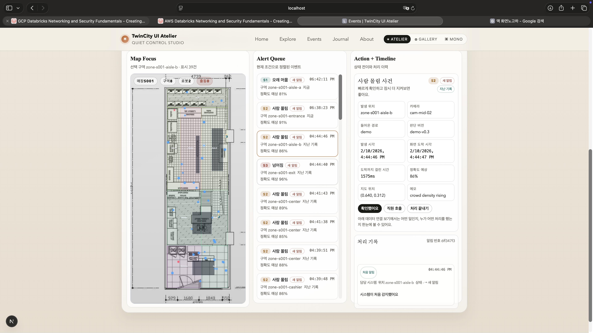

<<<<<<< HEAD
# TwinCity UI — Digital Twin Ops Console (WIP)

TwinCity UI is a Next.js (React/TypeScript) operations console that overlays **Zones (polygons)** and **Events (points)** on a floorplan, so an operator can triage alerts faster by combining:

- Spatial context (where it happened)
- Event context (what happened, severity, status)
- Workflow context (acknowledge, dispatch, resolve + timeline)

This project is in progress, but it is designed to be **reviewable end-to-end without external infrastructure**:
- Demo mode includes local mock feeds + replay tools.
- Live sources can be wired via WebSocket / SSE / HTTP polling (with graceful fallback).



## What I Owned (Team Project)
- End-to-end operator UX: Live/History views, filters, detail panel, action timeline, settings, and list ↔ map ↔ detail sync
- Reliability work: WS → SSE → HTTP polling fallback, connection state + auto-retry, demo-first mock feeds + replay
- Normalization layer (“ontology adapter”): unify inconsistent provider payload shapes into a single `EventItem` schema
- Spatial mapping: percent/world/bbox → normalized 0..1, optional camera homography, and snap-to-walkable zones (holes supported)

## Quickstart
```bash
npm ci
npm run dev
```
Open `http://127.0.0.1:3000/events`.

## Current Demo Scope (Works Today)
- Demo-first: runs locally with mock feeds (no backend required)
- Operator workflow: list/map selection sync, timeline actions (ACK/dispatch/resolve), local state restore, keyboard navigation
- Payload normalization: multiple provider shapes → one `EventItem` schema (adapter)
- Coordinate mapping + snapping: percent/world/bbox → normalized (0..1) and snapped to valid walkable areas
- Engineering rigor: CI (lint/test/build), runbook, postmortem template

## Next (In Progress)
- Expand “Reports” view for replay + aggregation
- More adapters for edge-device/VLM payload variants
- Additional calibration tooling for camera homography

## Live Sources (Optional)
Create `.env.local` from `.env.local.example` and set one or more:
```bash
# Priority: WS -> SSE -> HTTP polling
NEXT_PUBLIC_EVENT_WS_URL=wss://example.com/events
NEXT_PUBLIC_EVENT_STREAM_URL=https://example.com/events/stream
NEXT_PUBLIC_EVENT_API_URL=https://example.com/events
NEXT_PUBLIC_EVENT_POLL_MS=5000

# Community integrations (optional)
NEXT_PUBLIC_FORMSPREE_ENDPOINT=https://formspree.io/f/xxxxxx
NEXT_PUBLIC_DISQUS_SHORTNAME=your-shortname
NEXT_PUBLIC_DISQUS_IDENTIFIER=twincity-about
NEXT_PUBLIC_GISCUS_REPO=owner/repo
NEXT_PUBLIC_GISCUS_REPO_ID=R_kgxxxx
NEXT_PUBLIC_GISCUS_CATEGORY=General
NEXT_PUBLIC_GISCUS_CATEGORY_ID=DIC_kwxxxx

# AdSense (optional)
NEXT_PUBLIC_ADSENSE_CLIENT=ca-pub-xxxxxxxxxxxxxxxx
NEXT_PUBLIC_ADSENSE_SLOT=1234567890
```

## Local Mock Endpoint (Demo)
- `GET /api/mock/events?shape=a&count=4`
- `GET /api/mock/events?shape=b&count=4`
- `GET /api/mock/events?shape=single`
- `GET /api/mock/events?shape=edge&count=4`

## Key Routes
- `/events`: main operator console
- `/reports`: replay + aggregation view (WIP)
- `/about`: product intro + community + sponsored slot
- `/about`, `/privacy`, `/terms`, `/contact`, `/compliance`: policy/compliance pages for review

AdSense crawl helpers are provided in `public/ads.txt`, `public/robots.txt`, `public/sitemap.xml`, and `public/_headers`.

## Docs
- English: `README.en.md`
- Korean: `README.ko.md`
- Live integration (API contract + payload examples + fallbacks): `docs/LIVE_INTEGRATION.md`

## Ops Artifacts (Portfolio)
- `RUNBOOK.md`
- `POSTMORTEM_TEMPLATE.md`
- `.github/workflows/ci.yml` (CI: lint + test + build)

## Glossary (first-time readers)
- WS: WebSocket
- SSE: Server-Sent Events
- SLA: Service Level Agreement (time-to-ack / time-to-resolve targets)
=======
# MS_AI_Final_project
MS AI 3차 프로젝트
>>>>>>> ae7e31903d28dbcff4de58f5a9f16959f5ccfc97
