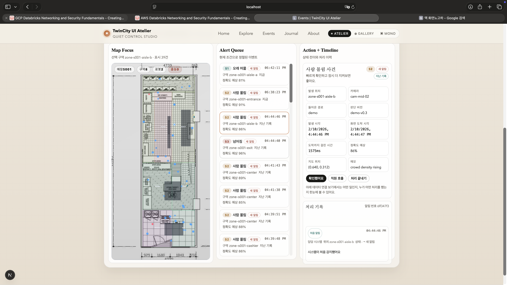

# Azure Digital Twins 기반의 지능형 매장 관제 및 로봇 인프라 구축 (TwinGuard)

MS AI 스쿨 3차 파이널 프로젝트 — 팀 **Vision Pro**

기존 CCTV 관제 시스템의 한계를 극복하고, 매장 관리 로봇 도입을 위한 실시간 데이터 환경을 조성하는 것을 목표로 한 프로젝트입니다. Edge(YOLO26 + VLM) → Azure IoT Hub → Cloud(Azure Functions, Digital Twins, Cosmos DB, SignalR) → Frontend/Robot으로 이어지는 엔드투엔드 파이프라인으로 구성되며, **이 저장소는 그중 프론트엔드 관제 대시보드("TwinCity UI")의 실제 구현 코드**입니다.



## 프로젝트 개요

| 항목 | 내용 |
| --- | --- |
| 기간 | 2026년 1월 (팀 프로젝트) |
| 팀명 | Vision Pro (서비스명: TwinGuard) |
| 인원 | 6인 |

| 팀원 | 역할 |
| --- | --- |
| 전혜나 (Leader) | 전체 시스템 아키텍처 설계 및 총괄, 엣지-클라우드-프론트엔드 간 데이터 규격 통합, 프로젝트 리드 |
| 고아름 (Bridge) | VLM 선정 및 테스트, 이상행동 로직, 엣지·최종 파이프라인 검증 |
| 박지성 (Vision Pipeline Engineer) | YOLO 모델 파인튜닝, 엣지 디바이스 실시간 객체 감지 성능 최적화 |
| 이주현 (Engineer) | IoT Hub 실시간 데이터 파이프라인 설계, IoT Hub/CosmosDB/SignalR 통신망 구축 |
| 강민지 (3D Digital Twin) | 2D→3D 좌표 매핑, 디지털 트윈 상황 정보 기반 시각적 피드백 구현 |
| 김도언 (UI 대시보드/온톨로지) | UI 대시보드 구현, 온톨로지 구현으로 데이터 계층화 및 비즈니스 인사이트 도출 |

## 문제 정의

대부분의 소규모(나홀로) 매장 관리는 CCTV 영상 하나에 의존하고 있습니다. ([관련 기사](https://www.khan.co.kr) — "'나홀로' 점포 내 범죄 노출 느는데, 대책은 고작 'CCTV 설치'", 경향신문)

기존 시스템의 한계는 다음 세 가지로 요약됩니다.

- **단순 녹화**: 사후 확인용 영상 저장에 그침
- **데이터 고립**: 카메라가 감지한 정보가 다른 시스템(로봇 등)과 연결되지 않음
- **수동적 관제**: 사람이 화면을 계속 지켜봐야만 이상 상황을 인지

→ 시스템이 스스로 위험을 판단하고, 그 판단 결과를 로봇 등 다른 시스템이 즉시 활용할 수 있는 **실시간 디지털 트윈 데이터 환경**이 필요합니다.

## 내 역할 (전혜나 · Leader)

- 전체 시스템 아키텍처 설계 및 총괄 (Edge → IoT Hub → Cloud → Frontend/Robot 파이프라인 설계)
- **엣지-클라우드-프론트엔드 간 데이터 규격 통합**: 각 파트가 서로 다른 형태로 만들어내는 이벤트 payload(단순 배열, `data.objects[]+vlm_analysis`, `alert.batch` 등 최소 4가지 형태)를 하나의 `EventItem` 스키마로 정규화하는 어댑터 계층을 설계·구현 ([`src/lib/eventAdapter.ts`](src/lib/eventAdapter.ts))
- 프로젝트 리드 (일정 관리, 팀 간 인터페이스 조율)

## 시스템 아키텍처

```
[CCTV Stream] ─▶ Edge (YOLO26 Detection+Pose, 이상행동 시 VLM 비동기 호출)
                  │  Event JSON (Crowd / Safety / Cleaning)
                  ▼
            Azure IoT Hub
                  │
                  ▼
      Azure Functions (main_func / negotiate / getEvents)
        ├─▶ Azure Cosmos DB      (이벤트 로그)
        ├─▶ Azure Digital Twins  (Store/Zone/Robot 온톨로지)
        └─▶ Azure SignalR        (실시간 push)
                  │
       ┌──────────┴──────────┐
       ▼                     ▼
Azure Static Web App    Unreal Engine 3D Twin
(관제 대시보드, 이 레포)   (매장 1:1 모델링)
                              │
                              ▼
                     Robot Command Center
```

## 주요 구현 내용

### 1. Vision Pipeline (Edge)
- **YOLO26** (2026-01-14 발표된 최신 SOTA, NMS-Free/E2E) 파인튜닝으로 실시간 객체 탐지
- **듀얼 트랙 추론**: YOLO-Detection(객체 탐지) + YOLO-Pose(17개 keypoint)를 헝가리안 알고리즘 기반 IoU 매칭으로 병합
- **기하학적 분석 + 3초 시계열 상태 머신**: keypoint 위치·bbox 비율로 신뢰도 점수를 산출하고, 노이즈를 필터링해 상태(정상/의심/확정)를 전환
- **비동기 VLM 피드백**: 상태 머신이 "의심" 단계에 진입했을 때만 VLM(Moondream)에 크롭 이미지를 비동기로 질의해 최종 상황을 확정하는 "조언자" 역할로 사용 → 매 프레임 VLM을 호출하지 않아 비용·지연을 최소화
- **Data-Centric AI**: 범용 쓰레기 데이터셋(TACO)이 실외·근접 촬영 위주라 실내 매장 CCTV 화각과 맞지 않는 문제를 발견하고, 매장 CCTV 특화 데이터셋 150장 이상을 직접 구축(사람/쓰레기 클래스, 다양한 매장·바닥 패턴 포함)
- **Responsible AI**: 다양한 인종·연령대·휠체어 이용 고객이 포함된 데이터로 공정성 고려

### 2. Cloud Pipeline
- Edge에서 발행하는 이벤트를 **혼잡도(Crowd) / 이상행동(Safety) / 청결(Cleaning)** 3종 JSON 스키마(`severity`: Info/Warning/Critical)로 표준화해 Azure IoT Hub로 전송
- **Azure Functions 3종**: `main_func.js`(이벤트 유형 판단 후 Cosmos DB 로그 저장 + Digital Twins 속성 업데이트 + SignalR 알림 발행), `negotiate.js`/`negotiate_front.js`(SignalR 언리얼/웹 토큰 발급), `getEvents.js`(Cosmos DB 과거 이벤트 조회)
- **예상 Azure 운영비**: 종량제 기준 월 4~5만원 수준 (IoT Hub 3~3.5만원 + Functions/CosmosDB/ADT/SignalR 1~2만원)

### 3. 3D Digital Twin
- CCTV 좌표 → 디지털 트윈 좌표 매핑(카메라 왜곡·원근 보정 로직 설계)
- Unreal Engine에 실제 매장 구조를 1:1 비율로 모델링, CCTV/센서 블루프린트 객체를 **ADT Link plugin**으로 Azure Digital Twins 온톨로지(`Sensor —hasCapability→ Capability`, `Space —hasPart/isPartOf→ Room`)에 연결
- Azure SignalR을 통해 상태 변경 이벤트를 구독해 UE 3D Scene에 실시간 반영
- 향후 확장: 트윈 공간 좌표 기반 로봇 경로 계획, 실제 매장에서의 자율 수거 동작 확장

### 4. Frontend — TwinCity UI (이 저장소)
- Next.js(React/TypeScript) 기반 관제 콘솔: 평면도 위에 **Zone(폴리곤) + Event(포인트)** 를 실시간 시각화
- **2D/3D 뷰 전환**: three.js 기반 3D 매장 뷰([`MapWorld3D.tsx`](src/components/MapWorld3D.tsx))와 2D 평면 뷰 동시 지원
- **온톨로지 패널**: 이벤트·공간 계층 구조를 시각화 ([`OntologyPanel.tsx`](src/components/OntologyPanel.tsx))
- **실시간 연결 안정성**: WebSocket → SSE → HTTP Polling 순으로 자동 폴백, 연결 실패 시 재시도 및 상태 표시
- **이벤트 정규화 어댑터**: 여러 소스가 보내는 서로 다른 payload 형태를 `EventItem` 단일 스키마로 통합 ([`src/lib/eventAdapter.ts`](src/lib/eventAdapter.ts))
- **카메라 좌표 보정**: bbox → 평면도 좌표 호모그래피 변환 ([`src/lib/homography.ts`](src/lib/homography.ts), [`coordinateTransform.ts`](src/lib/coordinateTransform.ts))
- 실서버 없이도 검증 가능한 로컬 Mock 이벤트 + 재생 도구, ACK/처리 타임라인, 필터, 새로고침 후 상태 복원(localStorage)

## 결과/성과

- 자체 구축한 매장 CCTV 특화 데이터셋(150장+)으로 파인튜닝하여, 범용 데이터셋(TACO) 기준 모델에서 발생하던 **손님이 든 물건을 쓰레기로 오탐지하는 문제를 해소**
- 혼잡도(0.5초 주기) / 이상행동(10초 이상 지속 시) / 청결(5분 이상 지속 시) 3종 이벤트를 Edge에서 1차 판단 후, 의심 상황에서만 VLM을 호출하는 구조로 **비용 효율적인 실시간 감지 파이프라인** 구축
- 종량제 기반 설계로 **Azure 예상 운영비를 월 4~5만원 수준**으로 경량화
- 프론트엔드는 **Azure Static Web Apps + Cloudflare Pages 이중 배포** 및 **GitHub Actions CI(lint/test/build)** 를 구축, 배포된 프로덕션 엔드포인트에 대해 **6시간 주기 자동 스모크 테스트**([`production-smoke.yml`](.github/workflows/production-smoke.yml))가 운영 중
- 최소 4가지 서로 다른 이벤트 payload 형태를 단일 스키마로 정규화하는 어댑터를 구축해, 팀원마다 다른 포맷으로 보내는 데이터를 프론트엔드에서 하나로 통합

## 어려웠던 점과 해결 방법

- **범용 쓰레기 데이터셋(TACO)의 촬영 환경 편향**: TACO는 야외·근접 촬영 사진 위주라 실내 매장 CCTV의 화각·거리와 맞지 않았고, 손님이 들고 있는 페트병 등을 쓰레기로 오인식하는 문제가 발생 → 매장 CCTV 환경(다양한 매장 종류, 바닥 패턴)을 반영한 자체 데이터셋 150장 이상을 직접 구축해 파인튜닝
- **팀원마다 다른 이벤트 데이터 포맷**: Vision/Cloud 파트에서 넘어오는 이벤트가 배열, `data.objects[]+vlm_analysis`, `alert.batch` 등 서로 다른 구조로 도착 → 프론트엔드에 ontology adapter(`eventAdapter.ts`)를 두어 모든 payload를 `id`, `detected_at`, `zone_id`, `x`, `y`를 포함하는 단일 `EventItem` 스키마로 정규화
- **실시간 연결의 신뢰성**: 매장 네트워크 환경에 따라 WebSocket 연결이 불안정할 수 있음 → WS → SSE → HTTP Polling 3단계 폴백과 자동 재연결 로직을 구현해 연결 방식에 관계없이 대시보드가 동작하도록 설계
- **CCTV 화각 왜곡으로 인한 좌표 오차**: 광각 CCTV 특성상 영상 속 객체 좌표가 실제 매장 좌표와 어긋남 → 카메라별 4점 보정(호모그래피) 데이터를 기반으로 bbox 중심점을 평면도 좌표로 변환하는 매핑 로직을 설계

## 배포 상태

- **프론트엔드(이 저장소)**: 실제로 배포되어 운영 중입니다.
  - Azure Static Web Apps에 GitHub Actions로 자동 배포 ([`azure-static-web-apps-happy-pond-087caca00.yml`](.github/workflows/azure-static-web-apps-happy-pond-087caca00.yml), main 브랜치 push/PR 트리거)
  - Cloudflare Pages에도 동시 배포 (`https://twincity-ui.pages.dev`, [`pages-auto-deploy.yml`](.github/workflows/pages-auto-deploy.yml))
  - 배포된 프로덕션 엔드포인트에 대해 6시간마다 자동 헬스체크(스모크 테스트) 실행
  - PR/push마다 lint + test + build CI 실행 ([`ci.yml`](.github/workflows/ci.yml))
- **Edge(YOLO26+VLM) / Cloud(IoT Hub·Functions·Digital Twins) / Unreal Engine 3D 트윈**: 발표자료 기준 아키텍처 설계와 파이프라인 구현이 완료된 **검증·프로토타입 단계**이며, 실 매장 상용 배포 여부는 별도 확인이 필요합니다.

## 로컬 실행 방법

```bash
npm ci
npm run dev
```

`http://127.0.0.1:3000/events` 접속 후, 상단 `데이터`에서 `연습(Demo)` 모드를 선택하고 샘플 이벤트를 주입해 확인할 수 있습니다. 실시간 소스 연동, Mock 엔드포인트, 좌표계 등 상세 내용은 [`README.ko.md`](README.ko.md)를 참고하세요.

## 기술 스택

- **Frontend**: Next.js, React, TypeScript, three.js, Azure SignalR(`@microsoft/signalr`)
- **Vision (Edge)**: YOLO26 (Detection + Pose), Moondream (VLM)
- **Cloud**: Azure IoT Hub, Azure Functions, Azure Digital Twins, Azure Cosmos DB, Azure SignalR, Azure Static Web Apps
- **3D Digital Twin**: Unreal Engine, ADT Link plugin

## 문서

- [README.en.md](README.en.md) — 영문 버전
- [README.ko.md](README.ko.md) — 프론트엔드 상세 기능/실행 가이드
- [docs/LIVE_INTEGRATION.md](docs/LIVE_INTEGRATION.md) — 실시간 API/WebSocket 연동 가이드
- [RUNBOOK.md](RUNBOOK.md) — 로컬 데모 런북
- [POSTMORTEM_TEMPLATE.md](POSTMORTEM_TEMPLATE.md) — 장애 회고 템플릿

## Glossary

- WS: WebSocket
- SSE: Server-Sent Events
- ADT: Azure Digital Twins
- VLM: Vision Language Model
- SLA: Service Level Agreement (time-to-ack / time-to-resolve targets)
